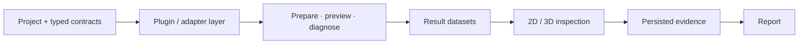

<!-- BRAND_REFRESH_2026_08_25 -->
<div align="center">

# 🛠️ OpenSolver Workbench

### Inspect the workflow, not just the answer.

**An open engineering solver and script workbench for typed project setup, guarded integrations, result inspection, 3D review, and reproducible report generation.**


[Try it](#quickstart) · [See the UI](#interface-preview) · [Workflow](#how-it-fits-together) · [Full technical reference](README.technical.2026-08-25.md)

</div>

---

> **Transparent engineering workflows should expose the setup, the handoff, the diagnostics, and the evidence — not only the final number.**

OpenSolver Workbench is a desktop and CLI environment for educational, research, and integration-review workflows across projects, scripts, meshes, solver cases, result datasets, visual inspection, and reports.

It is deliberately **not** positioned as an industrial-certified CAE suite, commercial CAD replacement, MATLAB clone, ANSYS clone, or automatic authority on engineering validity.

## What you can do

| Workspace | Capability |
|---|---|
| **Projects** | Create and validate typed engineering project contracts, materials, units, datasets, and saved scene state. |
| **Plugins and adapters** | Inspect optional Gmsh, CalculiX, OpenFOAM, Octave/MAT, CoolProp, and Cantera paths with explicit dependency diagnostics. |
| **3D review** | Render supported meshes, select entities, create NamedSelections, configure bounded solver setup, inspect diagnostics, and review compatible results. |
| **Evidence and reports** | Capture persisted views, inspect result metadata, and export HTML reports without hiding unsupported states. |

## How it fits together



## Quickstart

```powershell
git clone https://github.com/CAPTW/OpenSourceWorkBench.git
cd OpenSourceWorkBench
py -3.11 -m venv .venv
.\.venv\Scripts\python.exe -m pip install --upgrade pip
.\.venv\Scripts\python.exe -m pip install -e ".[gui]"
```

Smoke the CLI and open the GUI:

```powershell
.\.venv\Scripts\python.exe -m osw.cli --help
.\.venv\Scripts\python.exe -m osw.cli plugins-health
.\.venv\Scripts\python.exe -m osw.cli gui
```

## Interface preview

| Dark | Light | System |
| :---: | :---: | :---: |
|  |  |  |

## Trust contract

- Optional integrations fail with explicit diagnostics instead of pretending to be available.
- Solver preparation, execution authority, result compatibility, and visualization support remain separate contracts.
- Persisted reports use retained evidence rather than silently regenerating transient views.
- Unsupported mesh cells, solver setup kinds, stale fingerprints, and unprepared native paths remain visible limitations.
- Engineering interpretation remains the responsibility of a qualified user.

## Verification

```powershell
.\.venv\Scripts\python.exe -m pytest tests/unit -q
.\.venv\Scripts\python.exe -m pytest tests/integration -q -m "not external_solver"
.\.venv\Scripts\python.exe -m ruff check src tests tools
```

External-solver tests should run only on machines where the corresponding executable was intentionally installed and configured.

## Full technical reference

The original detailed README — including the complete feature inventory, tutorial ladder, 3D Workspace MVP acceptance path, release identities, optional dependencies, and implementation limits — is preserved unchanged at:

**[README.technical.2026-08-25.md](README.technical.2026-08-25.md)**
