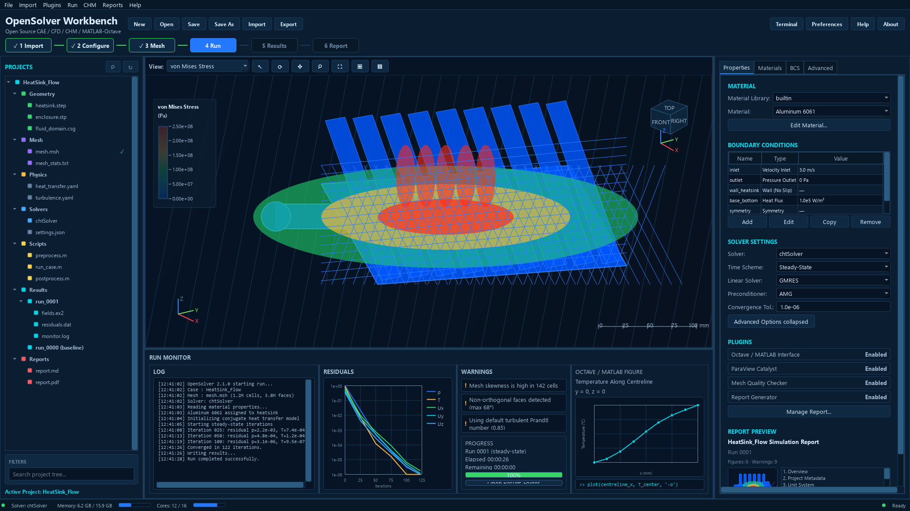
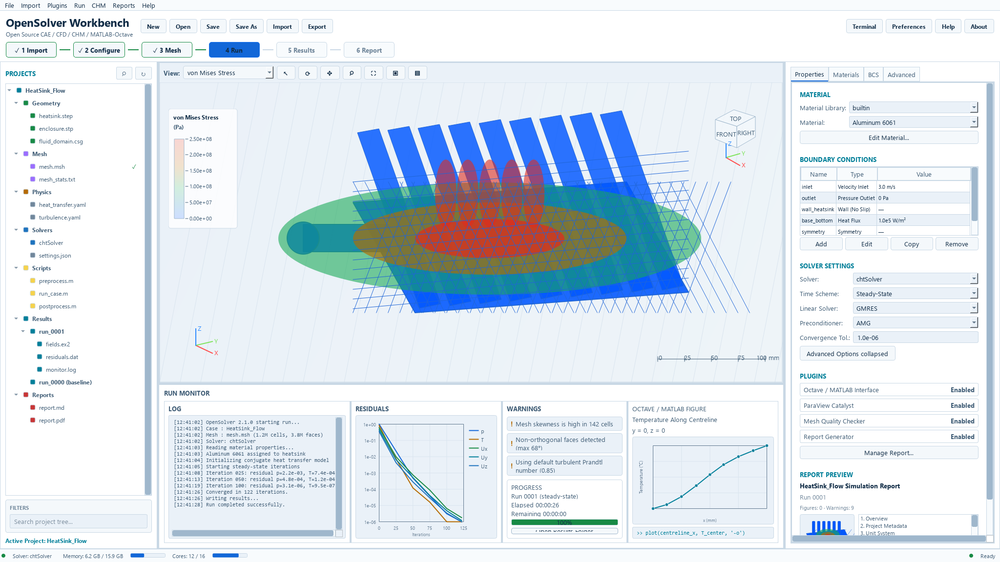

# First GUI Walkthrough

The GUI is optional and requires PySide6. Use this walkthrough to understand the
layout before adding optional solver stacks.

## Install GUI Extra

From the repository root:

```powershell
.venv\Scripts\python.exe -m pip install -e ".[gui]"
```

On Linux/macOS:

```bash
.venv/bin/python -m pip install -e ".[gui]"
```

## Launch

```powershell
.venv\Scripts\python.exe -m osw.cli gui
```

Linux/macOS:

```bash
.venv/bin/python -m osw.cli gui
```

If PySide6 is missing, the command should report an optional dependency
diagnostic. Missing PySide6 is not a base CLI failure.

## Layout

Use the committed screenshots as a visual map:

| Theme | Screenshot |
| --- | --- |
| Dark |  |
| Light |  |
| System |  |

Main areas:
- project tree: project items, imported files, and workflow objects
- viewer: preview/result/report surfaces
- properties: selected item metadata and validation messages
- run monitor: diagnostics and prepared-command state
- report/result panels: summaries, tables, field metadata, and report status

The GUI may prepare cases, preview commands, validate inputs, and inspect
results. It must not directly run external solver subprocesses from a button
path in v0.1.

## Headless Environments

In CI, remote shells, or machines without a desktop session, GUI launch or
visual rendering may be skipped. Use screenshots and CLI tutorials for
headless onboarding.

## Limitations

- GUI availability does not imply solver availability.
- PyVista field rendering remains optional.
- OSW is not an industrial-certified GUI solver platform.
